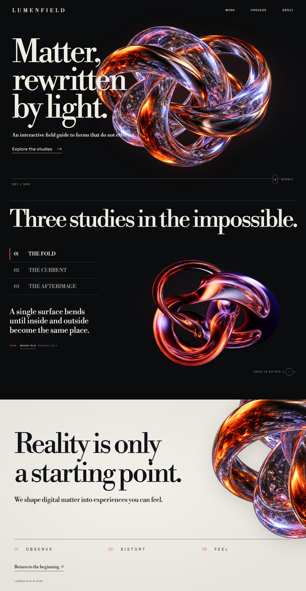

# LUMENFIELD

An interactive exhibition site built as a Design Genie showcase. The four visual concepts in `design/concepts/` guided the final implementation; `.design/` records the art direction, tokens, motion decisions, and review history.



## Run

```bash
cd showcase/lumenfield
npm install
npm run dev
```

Open the local URL printed by Vite. Use the study selector and drag the live sculpture to explore the forms. `npm run build` creates a production bundle. `npm run verify:ui` exercises the interaction path and saves desktop, mobile, fallback, first live frame, rotated, and mobile live screenshots in `design/final/`.

The Fold has two live models: **Woven Fold** is the default closed 3D ribbon, while **Original Helix** preserves the earlier cylindrical sculpture. Its desktop and mobile still previews are rendered from the Woven Fold itself. After changing its geometry, texture, lighting, or camera, run `npm run render:preview` while the dev server is running, then run `npm run verify:ui`.

From the repository root, run `npm run design -- probe --project showcase/lumenfield --url http://localhost:5173/ --selector .stage --action click --ready .stage.is-ready` for preview/live parity. Run a warmed drag probe with `--action drag --warm-ready .stage.is-ready --profile-ms 900` to inspect the rotated model and browser frame intervals. Run `npm run design -- capture --project showcase/lumenfield --url http://localhost:5173` and `npm run design -- audit --project showcase/lumenfield --url http://localhost:5173` for final three-viewport review.

The visual artwork was generated for this project. Three.js is MIT licensed; Libre Bodoni and Space Grotesk are SIL OFL. See `.design/REFERENCES.md` and `.design/REVIEW.md`.
